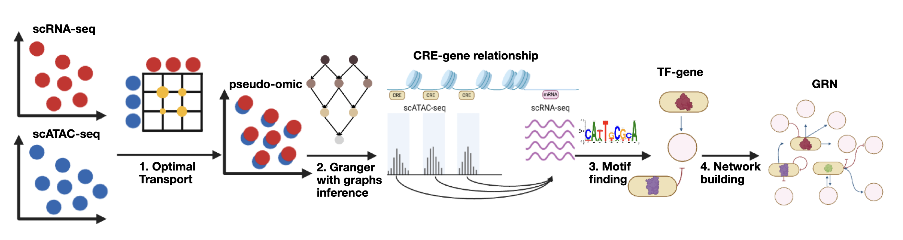

# GRIDOT


GRIDOT is a Gene regulatory network inference using Optimal Transport and Graph-based Granger Causality

GRIDOT (1)incorporates Optimal Transport to create pseudo-multiomic dataset from separate scRNA-seq and scATAC-seq 
(2) uses Granger causality to infer CREs and gene relationship 
(3) infers TFs-gene relationship
(4) reconstructs networks (optional)




## ANALYSIS TASKS

(1) Integrating separate scRNA-seq and scATAC-seq into a pseudo-multiomic dataset.
(2) Predicting and visualizing GRNs with Granger causality assumption.


## INSTALLATION

```
python -m venv GRIDOT
source GRIDOT/bin/activate
git clone git@github.com:Tu4n-ph4m/GRIDOT.git
cd GRIDOT
pip install -e .
```

## DOCUMENTATION
Before running tutorials, scRNA-seq and scATAC-seq need to be preprocessed and embedded to lower dimensions with PCA (scRNA-seq) and topic modelling (scATAC-seq). Examples can be found here.
We recommend following [scanpy](https://scanpy.readthedocs.io/en/stable/generated/scanpy.pl.dotplot.html) and [pycistopic](https://pycistopic.readthedocs.io/en/latest/features.html) tutorials for further details.
We provide tutorials for GRN inferences in two scenarios:

[CELL-TYPE-SPECIFIC](https://github.com/Tu4n-ph4m/GRIDOT/tree/main/official_tutorial/pbmc)

[POPULATION-LEVEL](https://github.com/Tu4n-ph4m/GRIDOT/tree/main/official_tutorial/human_kidney)

Datasets for tutorials can be downloaded [here](https://drive.google.com/drive/folders/1Lci6nIkM8B6ZO8i_T-Th8ah6ao_MFhmr)