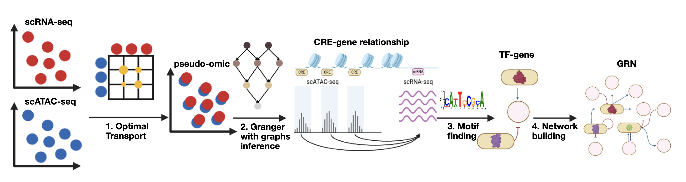

# GRIDOT


**Abstract**

Understanding how genes are regulated requires linking transcriptional programs to underlying chromatin states, yet most single-cell studies profile these modalities separately. We introduce **GRIDOT**, a framework for reconstructing gene regulatory networks by integrating single-cell RNA-seq and ATAC-seq data without requiring paired measurements. GRIDOT aligns transcriptional and chromatin accessibility profiles to create a pseudo-multiomic representation, enabling the inference of directed regulatory relationships. The method identifies cis-regulatory element–gene and transcription factor–gene interactions and assembles them into regulatory networks at cell-type–specific or population scales. By connecting chromatin regulation to gene expression in a unified framework, GRIDOT facilitates biological interpretation of regulatory mechanisms from unpaired single-cell multiomic data.
GRIDOT  
(1) integrates optimal transport to construct a pseudo-multiomic representation from independently generated scRNA-seq and scATAC-seq data;  
(2) applies Granger causality to infer regulatory relationships between cis-regulatory elements and target genes;  
(3) identifies transcription factor-gene regulatory interactions;  
(4) optionally reconstructs gene regulatory networks at cell-type–specific or population levels.



## ANALYSIS TASKS

(1) Integrating separate scRNA-seq and scATAC-seq into a pseudo-multiomic dataset.
(2) Predicting and visualizing GRNs with Granger causality assumption.


## INSTALLATION

```
python -m venv GRIDOT
source GRIDOT/bin/activate
git clone git@github.com:Tu4n-ph4m/GRIDOT.git
cd GRIDOT
pip install -e .
```

## DOCUMENTATION
Before running tutorials, scRNA-seq and scATAC-seq need to be preprocessed and embedded to lower dimensions with PCA (scRNA-seq) and topic modelling (scATAC-seq). Examples can be found here.
We recommend following [scanpy](https://scanpy.readthedocs.io/en/stable/generated/scanpy.pl.dotplot.html) and [pycistopic](https://pycistopic.readthedocs.io/en/latest/features.html) tutorials for further details.
We provide tutorials for GRN inferences in two scenarios:

[CELL-TYPE-SPECIFIC](https://github.com/Tu4n-ph4m/GRIDOT/tree/main/official_tutorial/pbmc)

[POPULATION-LEVEL](https://github.com/Tu4n-ph4m/GRIDOT/tree/main/official_tutorial/human_kidney)

Datasets for tutorials can be downloaded [here](https://drive.google.com/drive/folders/1Lci6nIkM8B6ZO8i_T-Th8ah6ao_MFhmr)

Original datasets can be found here:
[SNARE-seq](https://www.ncbi.nlm.nih.gov/geo/query/acc.cgi?acc=GSE126074)

[Kidney dataset](https://www.ncbi.nlm.nih.gov/geo/query/acc.cgi?acc=GSE185948)
[Drosophila 14-16h embryonic dataset](https://shendure-web.gs.washington.edu/content/members/DEAP_website/public/)
[Drosophila 3rd instar larval dataset](https://www.ncbi.nlm.nih.gov/geo/query/acc.cgi?acc=GSE214707)
